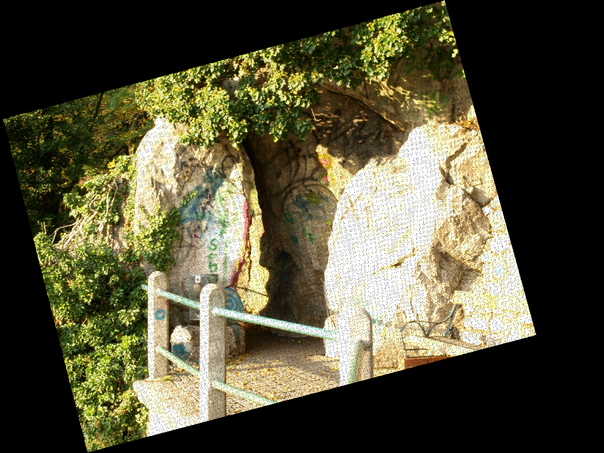
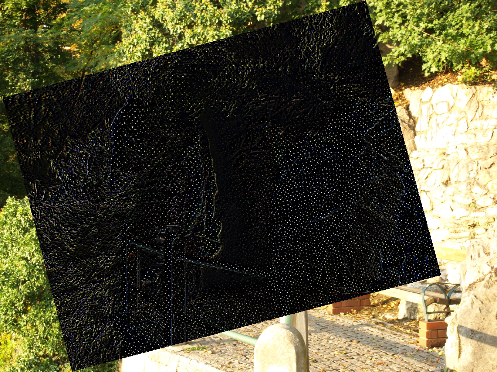

# 图像配准作业 
# No.2160508170
---
## 实验原理
本次实验中实现的图像配准基于图像的仿射变换，仿射变换矩阵参数通过对两幅图像之间匹配点利用最小二乘法得到。

## 实验步骤
实验主体分为取匹配点、计算变换矩阵、变换、结果输出这几个部分。

实验操作基于OpenCV。

- 取匹配点

    我们通过设置针对OpenCV窗口的鼠标事件的回调函数实现人机交互选取匹配点。原图像与目标图像各自将鼠标点击坐标写入到一个二维点列表中。列表通过回调函数的自定义数据指针传给回调函数。
    实验中我们取了以下的点对：
    - (1197, 1696) -> (908,1260)
    - (2179, 2084) -> (1756, 1881)
    - (2708, 1099) -> (2519, 1069)
    - (336, 1397)  -> (153, 739)
    - (2643, 553)  -> (2598, 524)
    - (966, 2114)  -> (572, 1608)
    - (971, 1900)  -> (636, 1398)
    - (2904, 1248) -> (2675, 1257)
    - (1425, 477)  -> (1439, 132)
- 计算变换矩阵

    变换矩阵利用OpenCV提供的findHomography函数实现。该函数通过计算下式最小值得出变换矩阵。
    $$\sum_i \left ( x'_i- \frac{h_{11} x_i + h_{12} y_i + h_{13}}{h_{31} x_i + h_{32} y_i + h_{33}} \right )^2+ \left ( y'_i- \frac{h_{21} x_i + h_{22} y_i + h_{23}}{h_{31} x_i + h_{32} y_i + h_{33}} \right )^2$$
    我们得到变换矩阵
$$
    H=\begin{pmatrix}
    0.9499920518713502 & 0.2407063852555208 & 18.75365313455547 \\
    -0.2572047215250381 & 0.9456669663322829 & 719.6974546656951 \\
    -2.948612149333082\times10^{-6} & -6.723284056523451\times10^{-6} & 1 \\
    \end{pmatrix}
$$

- 变换

    我们首先利用变换矩阵*H*得到待配准图像各个像素坐标映射位置，然后逐坐标将像素值复制到配准后图像的位置。像素坐标映射后的位置通过函数perspectiveTransform获得。
- 结果输出
  - 基准图像
    
  - 待配准图像
    
  - 配准结果
    
  - 配准结果与基准图像的差值
    

  可以看出基准图像与待配准图像在重叠区域实现了较好的重合，在差值图中表现为黑色区域。
  
  由于配准上的误差以及映射时存在的数值误差，在重合区域差值图像仍存在非完全为黑色的像素点。